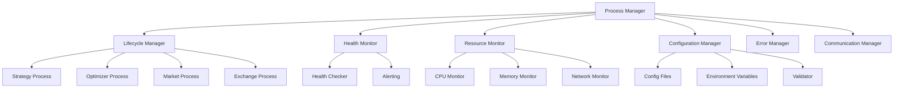

# Process Manager Implementation Design

## Overview

The Process Manager is designed as a comprehensive orchestration system for managing different types of processes in the QCAT trading system. It provides centralized lifecycle management, health monitoring, resource tracking, and inter-process communication while maintaining high availability and performance.

## Architecture

### Core Components



### Process Types and Responsibilities

1. **Strategy Process**: Executes trading strategies with real-time market data
2. **Optimizer Process**: Runs strategy optimization algorithms
3. **Market Process**: Ingests and processes market data from exchanges
4. **Exchange Process**: Manages exchange connectivity and order execution

## Components and Interfaces

### 1. Configuration Management System

#### Enhanced Configuration Loading
- **Multi-source Configuration**: Load from files, environment variables, and command-line arguments
- **Configuration Validation**: Comprehensive validation with detailed error messages
- **Hot Reloading**: Watch for configuration changes and reload without restart
- **Environment Overrides**: Support for environment-specific overrides

#### Implementation Details
```go
type ConfigManager struct {
    sources []ConfigSource
    validator *ConfigValidator
    watcher *FileWatcher
    cache *ConfigCache
}

type ConfigSource interface {
    Load() (*config.Config, error)
    Watch(callback func(*config.Config)) error
}
```

### 2. Resource Monitoring System

#### Real-time Resource Tracking
- **Memory Monitoring**: Track RSS, VMS, and heap usage using OS APIs
- **CPU Monitoring**: Per-process CPU usage with system call integration
- **Network Monitoring**: Track network I/O for exchange processes
- **Disk Monitoring**: Monitor disk usage for data storage processes

#### Implementation Details
```go
type ResourceMonitor struct {
    collectors map[string]ResourceCollector
    thresholds *ResourceThresholds
    alerter *ResourceAlerter
}

type ResourceCollector interface {
    CollectMetrics(pid int) (*ResourceMetrics, error)
    GetThresholds() *ResourceThresholds
}

type ResourceMetrics struct {
    MemoryRSS     uint64
    MemoryVMS     uint64
    CPUPercent    float64
    NetworkRx     uint64
    NetworkTx     uint64
    DiskRead      uint64
    DiskWrite     uint64
    Timestamp     time.Time
}
```

### 3. Health Monitoring System

#### Comprehensive Health Checks
- **Process-specific Health Checks**: Tailored health checks for each process type
- **Dependency Health**: Check health of dependent services
- **Performance Metrics**: Track response times and throughput
- **Automatic Recovery**: Implement recovery strategies for common failures

#### Implementation Details
```go
type HealthMonitor struct {
    checkers map[ProcessType]HealthChecker
    scheduler *HealthScheduler
    recovery *RecoveryManager
}

type HealthChecker interface {
    CheckHealth(ctx context.Context, process *Process) *HealthResult
    GetCheckInterval() time.Duration
    GetRecoveryActions() []RecoveryAction
}

type HealthResult struct {
    Status    HealthStatus
    Metrics   map[string]interface{}
    Issues    []HealthIssue
    Timestamp time.Time
}
```

### 4. Process Lifecycle Management

#### Advanced Process Control
- **Dependency Management**: Handle process dependencies and startup order
- **Graceful Shutdown**: Implement timeout-based graceful shutdown
- **State Persistence**: Save and restore process state across restarts
- **Recovery Policies**: Configurable restart policies with backoff

#### Implementation Details
```go
type LifecycleManager struct {
    processes map[ProcessType]*ProcessController
    dependencies *DependencyGraph
    stateStore *ProcessStateStore
}

type ProcessController struct {
    process *Process
    state *ProcessState
    config *ProcessConfig
    recovery *RecoveryPolicy
}

type ProcessState struct {
    Status        ProcessStatus
    StartTime     time.Time
    RestartCount  int
    LastError     error
    Dependencies  []ProcessType
    Checkpoints   []StateCheckpoint
}
```

### 5. Error Handling and Recovery

#### Robust Error Management
- **Error Classification**: Categorize errors by type and severity
- **Circuit Breaker**: Implement circuit breaker pattern for external dependencies
- **Retry Logic**: Exponential backoff with jitter for transient errors
- **Error Aggregation**: Collect and correlate errors across processes

#### Implementation Details
```go
type ErrorManager struct {
    classifier *ErrorClassifier
    circuitBreakers map[string]*CircuitBreaker
    retryPolicies map[ErrorType]*RetryPolicy
    aggregator *ErrorAggregator
}

type ErrorClassifier struct {
    rules []ClassificationRule
}

type CircuitBreaker struct {
    state CircuitState
    failureThreshold int
    timeout time.Duration
    halfOpenRequests int
}
```

### 6. Inter-Process Communication

#### Reliable Message Passing
- **Message Queue**: Implement reliable message queue between processes
- **Event Broadcasting**: Publish-subscribe pattern for event distribution
- **Process Coordination**: Distributed locking and leader election
- **Communication Monitoring**: Track message delivery and performance

#### Implementation Details
```go
type CommunicationManager struct {
    messageQueue *MessageQueue
    eventBus *EventBus
    coordinator *ProcessCoordinator
    monitor *CommunicationMonitor
}

type MessageQueue interface {
    Send(ctx context.Context, msg *Message) error
    Receive(ctx context.Context, queue string) (*Message, error)
    Subscribe(queue string, handler MessageHandler) error
}

type EventBus interface {
    Publish(ctx context.Context, event *Event) error
    Subscribe(topic string, handler EventHandler) error
    Unsubscribe(topic string, handler EventHandler) error
}
```

## Data Models

### Process Model
```go
type Process struct {
    ID           string
    Type         ProcessType
    Name         string
    Status       ProcessStatus
    StartTime    time.Time
    PID          int
    Config       *ProcessConfig
    Health       *HealthCheck
    Resources    *ResourceUsage
    Dependencies []ProcessType
    
    // Component instances
    StrategyRunner  *live.Runner
    Optimizer       *optimizer.Orchestrator
    MarketIngestor  *market.Ingestor
    ExchangeConn    exchange.Exchange
}

type ProcessConfig struct {
    Type         ProcessType
    Parameters   map[string]interface{}
    Resources    *ResourceLimits
    Health       *HealthConfig
    Recovery     *RecoveryConfig
    Dependencies []ProcessType
}

type ResourceLimits struct {
    MaxMemory    uint64
    MaxCPU       float64
    MaxNetwork   uint64
    MaxDisk      uint64
    MaxFileDesc  int
}
```

### Health Model
```go
type HealthCheck struct {
    LastCheck    time.Time
    Status       HealthStatus
    Error        error
    Metrics      map[string]interface{}
    History      []HealthRecord
    Thresholds   *HealthThresholds
}

type HealthRecord struct {
    Timestamp time.Time
    Status    HealthStatus
    Metrics   map[string]interface{}
    Issues    []string
}

type HealthThresholds struct {
    MemoryWarning  uint64
    MemoryCritical uint64
    CPUWarning     float64
    CPUCritical    float64
    ResponseTime   time.Duration
}
```

## Error Handling

### Error Classification System
- **Transient Errors**: Network timeouts, temporary service unavailability
- **Configuration Errors**: Invalid configuration, missing parameters
- **Resource Errors**: Out of memory, disk full, file descriptor limits
- **Business Logic Errors**: Strategy failures, optimization errors
- **System Errors**: OS-level errors, hardware failures

### Recovery Strategies
- **Automatic Restart**: For transient failures with exponential backoff
- **Configuration Reload**: For configuration-related errors
- **Resource Cleanup**: For resource exhaustion scenarios
- **Failover**: For critical service failures
- **Manual Intervention**: For complex errors requiring human analysis

## Testing Strategy

### Unit Testing
- **Configuration Loading**: Test all configuration sources and validation
- **Resource Monitoring**: Mock OS APIs and test metric collection
- **Health Checking**: Test all health check implementations
- **Error Handling**: Test error classification and recovery logic
- **Process Lifecycle**: Test startup, shutdown, and restart scenarios

### Integration Testing
- **Multi-Process Coordination**: Test process dependencies and communication
- **Configuration Hot Reloading**: Test configuration changes without restart
- **Resource Limit Enforcement**: Test resource monitoring and enforcement
- **Error Recovery**: Test automatic recovery scenarios
- **Performance**: Test under load with multiple processes

### Performance Testing
- **Health Check Performance**: Ensure checks complete within 100ms
- **Resource Monitoring Overhead**: Verify <1% CPU overhead
- **Process Startup Time**: Ensure <5 second startup
- **Memory Usage**: Monitor for memory leaks and growth
- **Scalability**: Test with 100+ concurrent processes

## Security Considerations

### Process Isolation
- **Resource Isolation**: Prevent processes from interfering with each other
- **Configuration Security**: Secure handling of API keys and secrets
- **Access Control**: Implement proper permissions for process operations
- **Audit Logging**: Log all process management operations

### Communication Security
- **Message Authentication**: Verify message authenticity
- **Encryption**: Encrypt sensitive inter-process communication
- **Authorization**: Control which processes can communicate
- **Rate Limiting**: Prevent communication abuse

## Deployment and Operations

### Configuration Management
- **Environment-specific Configs**: Support for dev, staging, production
- **Secret Management**: Integration with secret management systems
- **Configuration Validation**: Pre-deployment configuration validation
- **Rollback Capability**: Ability to rollback configuration changes

### Monitoring and Alerting
- **Metrics Export**: Export metrics to Prometheus/Grafana
- **Log Aggregation**: Centralized logging with structured format
- **Alert Rules**: Configurable alerting for various conditions
- **Dashboard**: Real-time process monitoring dashboard

### Maintenance Operations
- **Rolling Updates**: Update processes without downtime
- **Backup and Restore**: Process state backup and restoration
- **Capacity Planning**: Resource usage analysis and planning
- **Performance Tuning**: Optimization based on monitoring data