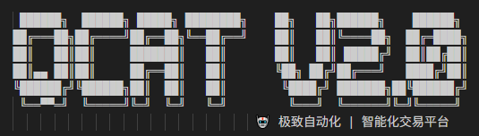

# Quantitative Crypto Automated Trading

**🚀 新一代双闭环智能交易系统 | AI驱动策略进化 | 完全自主交易 | 自愈容错**

QCAT v2.1 是一个革命性的加密货币智能化自动交易平台，采用创新的**双闭环架构**，将策略优化与交易执行完全分离。通过多策略并发工作流系统实现策略的持续进化，配合专业化的交易执行系统，形成了一个自我进化、持续优化的智能交易生态。

这个项目源自于：没有最完美测策略，只有在某个时间段适合某个币种的策略，所以开发了这个能够自动回测和优化参数的项目
> **⚠️ <span style="color:red">重要警告：</span> 本项目所有代码均由 AI 自动生成。由于 AI 在开发过程中可能遗留大量 TODO、空函数、硬编码、临时代码及简化逻辑，且难以全面排查，当前项目仍处于开发阶段。**  
> **请勿将本项目用于任何实盘交易或生产环境，后果自负！**




## ✨ 核心特性

### 🔄 双闭环智能架构
- **策略进化闭环** - 多策略并发优化，持续进化淘汰
- **交易执行闭环** - 专注已启用策略的稳定高效执行
- **智能策略池** - 两个闭环的关键交互点，动态策略管理
- **事件驱动同步** - 实时因子更新和策略状态同步
- **资源隔离管理** - 独立资源池，避免相互干扰

### 🧬 多策略工作流系统
- **并发策略优化** - 10个策略同时进行不同生命周期阶段
- **遗传算法进化** - 基于适应度的策略自动进化和淘汰
- **完整生命周期** - 策略引入→回测→优化→学习→应用→淘汰
- **智能资源分配** - 动态CPU和内存分配，负载均衡
- **自动化管理** - 无人工干预的策略持续优化

### 🎯 专业化交易执行
- **低延迟执行** - <10ms策略决策到订单发送
- **高吞吐量** - >1000 TPS交易处理能力
- **智能仓位管理** - 动态Black-Litterman优化 + Kelly系数
- **利润最大化引擎** - 多目标优化，风险调整收益最大化
- **自动对冲系统** - 智能相关性分析和动态对冲比率

### 🛡️ 全方位风险防护
- **多层风险管理** - 保守/稳健/进取三层分级管理
- **实时威胁检测** - 异常行为识别和自动响应
- **熔断保护机制** - 多级熔断器防止极端损失
- **资金安全保护** - 自动资金转移和应急保护协议
- **智能止损系统** - 动态止损线调整和风险预算控制

### 🔄 自愈容错能力
- **故障自动检测** - 毫秒级故障识别和分析
- **智能诊断引擎** - AI驱动的根因分析和影响评估
- **自动恢复执行** - 无人工干预的故障恢复机制
- **多交易所冗余** - 智能路由和自动故障转移
- **零停机运行** - 99.99%系统可用性保障

### 📊 数据分析自动化
- **AutoML引擎** - 全自动机器学习流程
- **自动回测验证** - 24/7策略性能验证和优化
- **因子自动挖掘** - 遗传编程算法发现新因子
- **策略自动生成** - AI生成和优化交易策略
- **实时性能监控** - 多维度策略表现分析

### 🌟 自我进化系统
- **持续学习优化** - 从交易数据中不断学习改进
- **模型自动更新** - 定期重训练和模型版本管理
- **策略适应性** - 根据市场变化自动调整策略
- **知识库积累** - 故障处理和策略优化经验积累
- **智能参数调优** - 超参数自动优化和A/B测试

## 🛠️ 技术架构

### 核心技术栈
- **后端**: Go 1.23 + Gin + WebSocket + gRPC
- **前端**: React 19 + Next.js 15 + TypeScript + shadcn/ui
- **数据存储**: PostgreSQL 15 + Redis 7
- **AI/ML**: AutoML引擎 + 遗传编程 + 深度学习
- **监控**: Prometheus + Grafana + 自定义指标
- **部署**: Docker + Docker Compose + Kubernetes
- **CI/CD**: GitHub Actions + 自动化测试

### 六层智能化架构
```
┌─────────────────────────────────────────────────────────┐
│                   🧠 Learning 层                        │
│              AutoML引擎 | 模型自动化 | 持续优化            │
├─────────────────────────────────────────────────────────┤
│                  🔧 Operations 层                       │
│           智能路由系统 | 自愈容错 | 运维自动化             │
├─────────────────────────────────────────────────────────┤
│                   📊 Analysis 层                        │
│           自动回测引擎 | 因子发现 | 性能验证               │
├─────────────────────────────────────────────────────────┤
│                    💰 Fund 层                          │
│           分层仓位管理 | 智能对冲 | 资金保护               │
├─────────────────────────────────────────────────────────┤
│                   🛡️ Security 层                       │
│           威胁检测 | 安全防护 | 风险控制                   │
├─────────────────────────────────────────────────────────┤
│                  🧠 Intelligence 层                     │
│        智能决策 | 动态优化 | 市场感知 | 利润最大化          │
└─────────────────────────────────────────────────────────┘
```


## 🚀 快速开始

### 系统要求

#### 基础环境
- **Go**: 1.23+ (支持泛型和最新特性)
- **Node.js**: 20+ (React 19 + Next.js 15)
- **PostgreSQL**: 15+ (高性能数据存储)
- **Redis**: 7+ (缓存和消息队列)

#### 推荐硬件配置
- **CPU**: 8核+ (并行计算需求)
- **内存**: 16GB+ (ML模型和大数据处理)
- **存储**: SSD 500GB+ (高性能I/O)
- **网络**: 稳定低延迟连接
- **GPU**: 可选 (深度学习加速)

### 安装步骤

1. 克隆仓库:
   ```bash
   git clone <repository-url>
   cd QCAT
   ```

2. 安装Go依赖:
   ```bash
   go mod download
   ```

3. 安装前端依赖:
   ```bash
   cd frontend
   npm install
   cd ..
   ```

4. 配置智能化系统:
   ```bash
   # 复制示例配置文件
   cp configs/config.yaml.example configs/config.yaml
   cp configs/production.yaml.example configs/production.yaml
   cp configs/intelligence.yaml.example configs/intelligence.yaml
   cp configs/automation.yaml.example configs/automation.yaml
   
   # 设置环境变量
   export DB_HOST=localhost
   export DB_PASSWORD=your_password
   export REDIS_HOST=localhost
   export BINANCE_API_KEY=your_api_key
   export BINANCE_API_SECRET=your_api_secret
   export JWT_SECRET=your_jwt_secret
   
   # 智能化系统配置
   export AUTOML_ENABLED=true
   export SELF_HEALING_ENABLED=true
   export INTELLIGENCE_LEVEL=high
   ```

5. 初始化数据库:
   ```bash
   # 创建数据库
   createdb qcat
   
   # 运行数据库迁移
   go run cmd/migrate/main.go -up
   ```

6. 启动智能化交易系统:
   
   **开发模式:**
   ```bash
   # 启动主服务器（智能化交易引擎）
   go run cmd/qcat/main.go
   
   # 启动优化器服务（新终端）
   go run cmd/optimizer/main.go
   
   # 启动前端管理界面（新终端）
   cd frontend
   npm run dev
   ```
   
   **一键启动（推荐）:**
   ```bash
   # Linux/macOS
   ./scripts/start_local.sh
   
   # Windows
   scripts\start_local.bat
   ```
   
   **生产模式（推荐）:**
   ```bash
   # 构建完整系统
   make build-all
   
   # 使用Docker部署智能化集群
   docker-compose -f docker-compose.prod.yml up -d
   
   # 验证所有智能化组件状态
   make verify-intelligence
   ```

### 🔧 智能化组件启动验证

系统启动后，访问以下端点验证各智能化组件：

```bash
# 系统健康检查
curl http://localhost:8082/health

# 智能化控制器状态
curl http://localhost:8082/api/v1/intelligence/status

# AutoML引擎状态
curl http://localhost:8082/api/v1/automl/status

# 自愈系统状态
curl http://localhost:8082/api/v1/healing/status

# 智能路由状态
curl http://localhost:8082/api/v1/routing/status
```


## ⚙️ 智能化配置系统

QCAT v2.0 采用分层配置架构，支持多环境和智能化参数动态调整。

### 核心配置文件

#### `configs/config.yaml` - 基础系统配置
```yaml
app:
  name: qcat
  version: 2.0.0
  env: production
  debug: false

server:
  host: 0.0.0.0
  port: 8082
  read_timeout: 30s
  write_timeout: 30s
  max_header_bytes: 1048576

database:
  driver: postgres
  host: ${DB_HOST:localhost}
  port: ${DB_PORT:5432}
  name: ${DB_NAME:qcat}
  user: ${DB_USER:postgres}
  password: ${DB_PASSWORD}
  sslmode: ${DB_SSLMODE:require}
  max_open_conns: 100
  max_idle_conns: 10

redis:
  enabled: true
  host: ${REDIS_HOST:localhost}
  port: ${REDIS_PORT:6379}
  password: ${REDIS_PASSWORD}
  db: 0
  pool_size: 100
```

#### `configs/intelligence.yaml` - 智能化系统配置
```yaml
intelligence:
  enabled: true
  level: high  # low, medium, high, extreme
  
  position_optimizer:
    enabled: true
    update_interval: 1m
    black_litterman:
      tau: 0.025
      risk_aversion: 3.0
    kelly_criterion:
      enabled: true
      max_kelly_fraction: 0.25
  
  market_regime:
    enabled: true
    lookback_period: 252
    volatility_threshold: 0.02
    trend_threshold: 0.15
  
  smart_execution:
    enabled: true
    max_participation_rate: 0.1
    min_order_size: 100
    adaptive_sizing: true
    
  profit_maximizer:
    enabled: true
    optimization_method: "multi_objective"
    risk_budget: 0.02
    rebalance_threshold: 0.05
```

#### `configs/automation.yaml` - 自动化控制配置
```yaml
automation:
  position_management:
    enabled: true
    monitoring_interval: 30s
    pnl_threshold: -0.05
    margin_warning_ratio: 0.8
    auto_reduce_enabled: true
    
  security_guardian:
    enabled: true
    threat_detection_interval: 10s
    anomaly_threshold: 3.0
    auto_freeze_enabled: true
    
  fund_protection:
    enabled: true
    circuit_breaker:
      loss_threshold: 0.1
      time_window: 1h
    auto_transfer:
      trigger_ratio: 0.95
      target_ratio: 0.8
      
  self_healing:
    enabled: true
    health_check_interval: 5s
    failure_threshold: 3
    recovery_timeout: 30s
```

## 🛠️ 开发指南

### 运行测试

#### 使用Makefile
```bash
# 运行所有测试
make test

# 运行单元测试
make test-unit

# 运行集成测试
make test-integration

# 运行E2E测试
make test-e2e

# 生成测试覆盖率报告
make test-coverage
```

#### 使用测试脚本
```bash
# 运行所有测试
./scripts/run_tests.sh

# 运行特定类型测试
./scripts/run_tests.sh unit        # 单元测试
./scripts/run_tests.sh coverage    # 覆盖率测试
./scripts/run_tests.sh integration # 集成测试
./scripts/run_tests.sh e2e         # E2E测试
./scripts/run_tests.sh benchmark   # 基准测试
./scripts/run_tests.sh quality     # 代码质量检查
```

#### 运行API测试
```bash
# 测试所有API端点
./scripts/test_api.sh

# 指定不同的基础URL
./scripts/test_api.sh -u http://localhost:8080

# 设置超时时间
./scripts/test_api.sh -t 30
```

#### 传统方式
```bash
# 运行所有测试
go test ./...

# 运行特定模块测试
go test ./internal/intelligence/...
go test ./internal/security/...
go test ./internal/learning/...

# 运行压力测试
go test -race -bench=. ./...

# 生成测试覆盖率报告
go test -coverprofile=coverage.out ./...
go tool cover -html=coverage.out
```

### 构建应用

```bash
# 构建主应用
go build -o bin/qcat cmd/qcat/main.go

# 构建优化器
go build -o bin/optimizer cmd/optimizer/main.go

# 构建所有组件
make build-all

# 交叉编译
GOOS=linux GOARCH=amd64 go build -o bin/qcat-linux cmd/qcat/main.go
```

### 智能化开发工作流

```bash
# 1. 启动开发环境
make dev-setup

# 2. 启动智能化组件（开发模式）
make dev-intelligence

# 3. 运行智能化测试套件
make test-intelligence

# 4. 性能基准测试
make benchmark-intelligence

# 5. 生成智能化组件文档
make docs-intelligence
```

### Docker部署

#### 开发环境
```bash
# 构建开发镜像
docker build -f Dockerfile.dev -t qcat:dev .

# 启动开发环境
docker-compose -f docker-compose.dev.yml up -d
```

#### 生产环境  
```bash
# 构建生产镜像
docker build -f Dockerfile.prod -t qcat:v2.0 .

# 启动智能化集群
docker-compose -f docker-compose.prod.yml up -d

# 扩展智能化服务
docker-compose -f docker-compose.prod.yml up -d --scale intelligence=3
```

### 智能化组件开发

#### 添加新的智能模块
```bash
# 1. 创建模块目录
mkdir -p internal/intelligence/your_module

# 2. 使用模板生成基础代码
go run scripts/generate_intelligence_module.go your_module

# 3. 实现接口
# 编辑生成的文件，实现 IntelligenceModule 接口

# 4. 注册到控制器
# 在 internal/intelligence/controller.go 中注册新模块
```

#### ML模型集成
```bash
# 1. 训练新模型
go run scripts/train_model.go --model-type=your_type

# 2. 验证模型性能
go run scripts/validate_model.go --model-path=models/your_model

# 3. 部署到AutoML引擎
go run scripts/deploy_model.go --model-path=models/your_model
```

## 🤝 贡献指南

### 参与开发

1. **Fork 本仓库**
   ```bash
   git clone https://github.com/your-username/QCAT.git
   cd QCAT
   ```

2. **创建功能分支**
   ```bash
   git checkout -b feature/intelligent-feature-name
   ```

3. **开发智能化功能**
   - 遵循智能化架构设计原则
   - 实现自动化和自愈能力
   - 添加完整的测试覆盖
   - 更新相关文档

4. **运行完整测试**
   ```bash
   make test-all
   make lint
   make security-scan
   ```

5. **提交 Pull Request**
   - 详细描述功能改进
   - 包含性能基准对比
   - 提供智能化效果演示

### 开发规范

#### 智能化模块标准
- 必须实现 `IntelligenceModule` 接口
- 支持优雅启动和停止
- 提供健康检查端点
- 包含性能指标收集
- 支持配置热重载

#### 代码质量要求
- 测试覆盖率 ≥ 90%
- 性能回归测试通过
- 安全扫描无高危漏洞
- 文档完整性检查通过

### 功能路线图

#### 🚀 v2.1 计划功能
- [ ] 量子计算优化算法集成
- [ ] 多模态AI预测引擎
- [ ] 去中心化智能决策网络
- [ ] 零知识证明隐私保护

#### 🔮 v3.0 愿景功能
- [ ] AGI驱动的自主交易
- [ ] 跨链智能套利系统
- [ ] 元宇宙交易界面
- [ ] 情感AI市场分析

## 未测试
功能设计上是支持github action、docker、make，但我没测试过

## 📄 许可证

本项目采用 **MIT 许可证** - 详情请参阅 [LICENSE](LICENSE) 文件。

## 🆘 支持与社区

### 获取帮助
- 📖 **文档**: [完整文档](docs/)
- 🐛 **Bug报告**: [GitHub Issues](https://github.com/wynnforthework/QCAT/issues)
- 💡 **功能建议**: [GitHub Discussions](https://github.com/wynnforthework/QCAT/discussions)
---

**🤖 QCAT v2.0 - 让AI为您的交易保驾护航！**

*"在金融市场的波涛中，让人工智能成为您最可靠的舵手。"*