# 26项自动化功能依赖关系分析

## 概述
本文档分析26项自动化功能之间的依赖关系、冲突关系和执行优先级，为工作流引擎设计提供基础。

## 功能分类与层级

### 第一层：基础数据与监控层
这些功能为其他功能提供基础数据和监控支持，必须首先启动。

**18. 数据清洗与校正** (优先级: 1)
- 依赖: 无
- 被依赖: 19, 20, 24, 25, 26
- 冲突: 无
- 执行时间: 持续运行
- 描述: 为所有功能提供清洁的数据基础

**21. 系统健康监控** (优先级: 1)
- 依赖: 无
- 被依赖: 22, 23
- 冲突: 无
- 执行时间: 持续运行
- 描述: 监控系统状态，为故障转移提供支持

**23. 日志与审计追踪** (优先级: 1)
- 依赖: 无
- 被依赖: 所有功能
- 冲突: 无
- 执行时间: 持续运行
- 描述: 记录所有操作，支持审计和回溯

### 第二层：市场分析与风险监控层
基于基础数据进行市场分析和风险监控。

**26. 市场模式识别** (优先级: 2)
- 依赖: 18
- 被依赖: 1, 6, 8, 10, 24, 25
- 冲突: 无
- 执行时间: 每5分钟
- 描述: 识别市场状态，指导策略选择

**12. 异常行情应对** (优先级: 2)
- 依赖: 18, 21
- 被依赖: 5, 9, 16
- 冲突: 4, 11
- 执行时间: 实时监控
- 描述: 检测异常行情，触发保护机制

**13. 账户安全监控** (优先级: 2)
- 依赖: 21, 23
- 被依赖: 14
- 冲突: 无
- 执行时间: 持续运行
- 描述: 监控账户安全，防范风险

### 第三层：策略管理层
管理策略的生命周期，包括引入、优化、淘汰。

**8. 新策略引入** (优先级: 3)
- 依赖: 18, 19, 26
- 被依赖: 1, 2, 7
- 冲突: 7
- 执行时间: 每日
- 描述: 引入新策略到策略池

**19. 自动回测与前测** (优先级: 3)
- 依赖: 18
- 被依赖: 1, 2, 6, 8, 24, 25
- 冲突: 无
- 执行时间: 每日
- 描述: 验证策略有效性

**20. 因子库动态更新** (优先级: 3)
- 依赖: 18, 26
- 被依赖: 1, 6, 24, 25
- 冲突: 无
- 执行时间: 每周
- 描述: 更新有效因子库

### 第四层：策略优化层
对策略参数进行优化和调整。

**1. 策略参数自动优化** (优先级: 4)
- 依赖: 18, 19, 20, 26
- 被依赖: 2, 6
- 冲突: 6
- 执行时间: 每周
- 描述: 优化策略参数

**6. 周期性策略优化** (优先级: 4)
- 依赖: 1, 19, 20, 26
- 被依赖: 2, 7
- 冲突: 1
- 执行时间: 每月
- 描述: 定期重新训练策略

**24. 策略自学习(AutoML)** (优先级: 4)
- 依赖: 18, 19, 20, 26
- 被依赖: 25
- 冲突: 25
- 执行时间: 每周
- 描述: 自动尝试不同算法

**25. 遗传淘汰制升级** (优先级: 4)
- 依赖: 18, 19, 20, 24, 26
- 被依赖: 8
- 冲突: 24
- 执行时间: 每月
- 描述: 进化优秀策略

### 第五层：策略应用层
将优化后的策略应用到实际交易中。

**2. 最佳参数应用** (优先级: 5)
- 依赖: 1, 6, 19
- 被依赖: 3, 4, 5
- 冲突: 无
- 执行时间: 每日
- 描述: 应用最优参数

**7. 策略淘汰与限时禁用** (优先级: 5)
- 依赖: 6, 8
- 被依赖: 15
- 冲突: 8
- 执行时间: 每周
- 描述: 淘汰表现差的策略

**10. 热门币种推荐** (优先级: 5)
- 依赖: 26
- 被依赖: 3, 4, 15
- 冲突: 无
- 执行时间: 每日
- 描述: 推荐热门交易币种

### 第六层：仓位管理层
管理资金分配和仓位控制。

**15. 资金动态分配** (优先级: 6)
- 依赖: 7, 10
- 被依赖: 3, 4, 16, 17
- 冲突: 无
- 执行时间: 每小时
- 描述: 根据策略表现分配资金

**3. 仓位动态优化** (优先级: 6)
- 依赖: 2, 10, 15
- 被依赖: 4, 5, 16
- 冲突: 无
- 执行时间: 每15分钟
- 描述: 优化杠杆和仓位大小

**16. 仓位分层机制** (优先级: 6)
- 依赖: 3, 12, 15
- 被依赖: 4, 5
- 冲突: 无
- 执行时间: 实时
- 描述: 分层管理大仓位

**17. 自动化多策略对冲** (优先级: 6)
- 依赖: 15
- 被依赖: 无
- 冲突: 无
- 执行时间: 实时
- 描述: 多策略对冲降低风险

### 第七层：交易执行层
执行具体的交易操作。

**4. 智能建仓/减仓/平仓** (优先级: 7)
- 依赖: 2, 3, 10, 15, 16
- 被依赖: 5, 9, 11
- 冲突: 12
- 执行时间: 实时
- 描述: 执行仓位调整操作

**5. 自动止盈止损** (优先级: 7)
- 依赖: 2, 3, 12, 16
- 被依赖: 9, 11
- 冲突: 无
- 执行时间: 实时
- 描述: 自动止盈止损

**9. 止盈止损线自动调整** (优先级: 7)
- 依赖: 4, 5, 12
- 被依赖: 11
- 冲突: 无
- 执行时间: 实时
- 描述: 动态调整止盈止损线

### 第八层：收益优化层
全局优化收益表现。

**11. 利润最大化引擎** (优先级: 8)
- 依赖: 4, 5, 9
- 被依赖: 无
- 冲突: 12
- 执行时间: 每小时
- 描述: 全局收益最大化

### 第九层：安全保障层
提供安全保障和故障转移。

**14. 资金分散与转移** (优先级: 9)
- 依赖: 13
- 被依赖: 无
- 冲突: 无
- 执行时间: 每日
- 描述: 转移部分盈利到安全账户

**22. 多交易所冗余** (优先级: 9)
- 依赖: 21
- 被依赖: 无
- 冲突: 无
- 执行时间: 故障时触发
- 描述: 交易所故障时自动切换

## 依赖关系矩阵

| 功能ID | 直接依赖 | 间接依赖 | 被依赖 | 冲突 |
|--------|----------|----------|--------|------|
| 1 | 18,19,20,26 | - | 2,6 | 6 |
| 2 | 1,6,19 | 18,20,26 | 3,4,5 | - |
| 3 | 2,10,15 | 1,6,7,10,15,18,19,20,26 | 4,5,16 | - |
| 4 | 2,3,10,15,16 | 1,6,7,10,12,15,18,19,20,26 | 5,9,11 | 12 |
| 5 | 2,3,12,16 | 1,6,10,15,18,19,20,21,26 | 9,11 | - |
| 6 | 1,19,20,26 | 18 | 2,7 | 1 |
| 7 | 6,8 | 1,18,19,20,26 | 15 | 8 |
| 8 | 18,19,26 | - | 1,2,7 | 7 |
| 9 | 4,5,12 | 1,2,3,6,10,15,16,18,19,20,21,26 | 11 | - |
| 10 | 26 | 18 | 3,4,15 | - |
| 11 | 4,5,9 | 1,2,3,6,10,12,15,16,18,19,20,21,26 | - | 12 |
| 12 | 18,21 | - | 5,9,16 | 4,11 |
| 13 | 21,23 | - | 14 | - |
| 14 | 13 | 21,23 | - | - |
| 15 | 7,10 | 1,6,8,18,19,20,26 | 3,4,16,17 | - |
| 16 | 3,12,15 | 1,2,6,7,8,10,18,19,20,21,26 | 4,5 | - |
| 17 | 15 | 1,6,7,8,10,18,19,20,26 | - | - |
| 18 | - | - | 1,8,19,20,24,25,26 | - |
| 19 | 18 | - | 1,2,6,8,24,25 | - |
| 20 | 18,26 | - | 1,6,24,25 | - |
| 21 | - | - | 12,13,22 | - |
| 22 | 21 | - | - | - |
| 23 | - | - | 13 | - |
| 24 | 18,19,20,26 | - | 25 | 25 |
| 25 | 18,19,20,24,26 | - | 8 | 24 |
| 26 | 18 | - | 1,6,8,10,20,24,25 | - |

## 执行阶段划分

基于依赖关系，将26项功能划分为9个执行阶段：

**阶段1 (基础层)**: 18, 21, 23
**阶段2 (监控层)**: 26, 12, 13
**阶段3 (策略管理层)**: 8, 19, 20
**阶段4 (策略优化层)**: 1, 6, 24, 25
**阶段5 (策略应用层)**: 2, 7, 10
**阶段6 (仓位管理层)**: 15, 3, 16, 17
**阶段7 (交易执行层)**: 4, 5, 9
**阶段8 (收益优化层)**: 11
**阶段9 (安全保障层)**: 14, 22

## 冲突管理策略

1. **互斥冲突**: 功能1和6不能同时执行（都涉及策略优化）
2. **资源冲突**: 功能4和12不能同时执行（都需要大量计算资源）
3. **逻辑冲突**: 功能7和8不能同时执行（策略淘汰vs引入）
4. **性能冲突**: 功能11和12不能同时执行（收益优化vs风险控制）
5. **数据冲突**: 功能24和25不能同时执行（都涉及策略进化）

## 负载均衡策略

1. **时间分散**: 将计算密集型任务分散到不同时间段
2. **资源隔离**: 为不同类型的任务分配独立的资源池
3. **优先级调度**: 高优先级任务优先获得资源
4. **动态调整**: 根据系统负载动态调整任务执行频率

## 故障恢复机制

1. **依赖检查**: 执行前检查所有依赖是否满足
2. **失败重试**: 失败任务自动重试，最多3次
3. **降级执行**: 依赖不满足时使用默认参数执行
4. **跳过机制**: 连续失败的任务暂时跳过，避免阻塞整个流程

