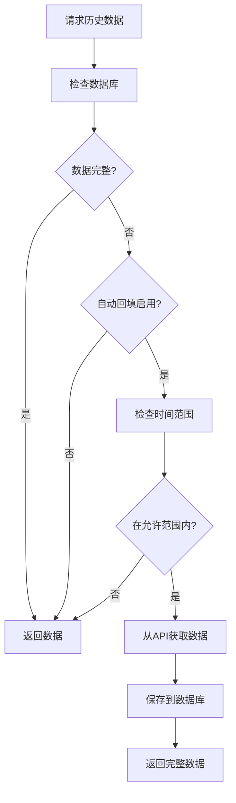
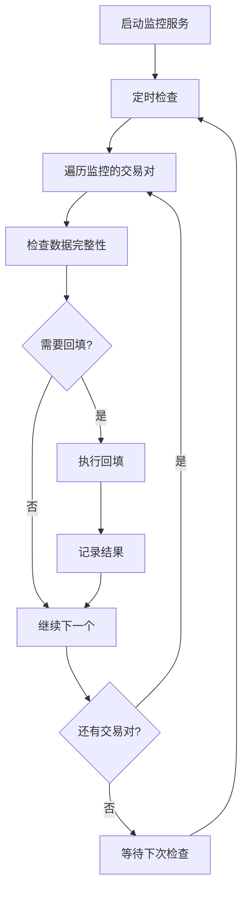

# 自动回填功能详解

QCAT项目现在具备了完整的自动回填功能，能够在需要历史数据时自动检测数据缺失并从Binance API获取数据。

## 🎯 核心功能

### 1. 智能数据获取
当任何地方需要BTCUSDT或其他交易对的历史数据时，系统会：
- ✅ 首先检查数据库中的数据完整性
- ✅ 如果数据不完整（低于设定阈值），自动从Binance API回填
- ✅ 只获取缺失的数据，避免重复
- ✅ 支持重试机制和错误处理

### 2. 自动回填触发条件
- **数据完整度低于阈值**（默认80%）
- **时间范围在允许的回填范围内**（默认90天）
- **有可用的Binance API客户端**
- **自动回填功能已启用**

### 3. 多种使用方式
- **透明集成**: MarketAnalyzer自动使用
- **显式调用**: 手动确保数据可用
- **装饰器模式**: 包装任何需要数据的操作
- **后台服务**: 定期监控和回填

## 🛠️ 使用方法

### 1. 透明自动回填（推荐）

最简单的方式，系统自动处理一切：

```go
// 创建带自动回填功能的分析器
analyzer := generator.NewMarketAnalyzer(db, binanceClient, klineManager)

// 分析市场数据 - 如果数据库中没有足够的BTCUSDT数据，会自动回填
analysis, err := analyzer.AnalyzeMarket(ctx, "BTCUSDT", 30*24*time.Hour)
if err != nil {
    log.Fatal(err)
}

// 数据已经自动回填，可以直接使用分析结果
fmt.Printf("波动率: %.4f\n", analysis.Volatility)
```

### 2. 智能历史数据获取

直接获取历史数据，自动回填缺失部分：

```go
// 获取历史数据，如果不完整会自动回填
klines, err := klineManager.GetHistoryWithBackfill(ctx, "BTCUSDT", kline.Interval1h, startTime, endTime)
if err != nil {
    log.Fatal(err)
}

fmt.Printf("获取到 %d 条K线数据\n", len(klines))
```

### 3. 确保数据可用性

在执行重要操作前，确保数据可用：

```go
// 确保数据可用（如果不可用会自动回填）
err := klineManager.EnsureDataAvailable(ctx, "BTCUSDT", kline.Interval1h, startTime, endTime)
if err != nil {
    log.Fatal(err)
}

// 现在可以安全地获取数据
klines, _ := klineManager.LoadHistoricalKlines(ctx, "BTCUSDT", kline.Interval1h, startTime, endTime)
```

### 4. 装饰器模式

包装任何需要历史数据的操作：

```go
// 使用装饰器执行需要历史数据的操作
err := klineManager.WithAutoBackfill(ctx, "BTCUSDT", kline.Interval1h, startTime, endTime, 
    func(klines []*kline.Kline) error {
        // 在这里执行需要历史数据的操作
        // 数据已经确保可用
        
        // 例如：计算技术指标
        rsi := calculateRSI(klines)
        fmt.Printf("RSI: %.2f\n", rsi)
        
        return nil
    })
```

### 5. 后台自动监控服务

设置后台服务，定期检查和回填数据：

```go
// 创建自动回填服务
autoService := kline.NewAutoBackfillService(klineManager)

// 添加需要监控的交易对
autoService.AddWatchedSymbol("BTCUSDT", kline.Interval1h, kline.Interval1d)
autoService.AddWatchedSymbol("ETHUSDT", kline.Interval1h)

// 设置检查间隔
autoService.SetCheckInterval(time.Hour) // 每小时检查一次

// 启动服务
go func() {
    if err := autoService.Start(ctx); err != nil {
        log.Printf("自动回填服务错误: %v", err)
    }
}()

// 服务会在后台自动监控数据完整性并回填
```

## ⚙️ 配置选项

### 自动回填配置

```go
config := &kline.AutoBackfillConfig{
    Enabled:                true,   // 启用自动回填
    MinCompletenessPercent: 85.0,   // 最小完整度阈值（85%）
    MaxBackfillDays:        60,     // 最大回填天数（60天）
    RetryAttempts:          3,      // 重试次数
    RetryDelay:             5 * time.Second, // 重试延迟
}

klineManager.SetAutoBackfillConfig(config)
```

### 配置参数说明

- **Enabled**: 是否启用自动回填功能
- **MinCompletenessPercent**: 数据完整度阈值，低于此值触发回填
- **MaxBackfillDays**: 最大回填天数，超过此范围的历史数据不会回填
- **RetryAttempts**: API调用失败时的重试次数
- **RetryDelay**: 重试之间的延迟时间

## 📊 监控和状态

### 数据完整性检查

```go
// 检查数据完整性
report, err := klineManager.CheckDataIntegrity(ctx, "BTCUSDT", kline.Interval1h, startTime, endTime)
if err != nil {
    log.Fatal(err)
}

fmt.Printf("数据完整度: %.2f%%\n", report.Completeness)
fmt.Printf("期望数据点: %d\n", report.ExpectedCount)
fmt.Printf("实际数据点: %d\n", report.ActualCount)
fmt.Printf("数据间隙: %d个\n", len(report.Gaps))
```

### 服务状态监控

```go
// 获取自动回填服务状态
status := autoService.GetStatus()
fmt.Printf("服务状态: %+v\n", status)

// 获取回填历史记录
history := autoService.GetBackfillHistory(10) // 最近10条记录
for _, record := range history {
    fmt.Printf("%s %s: %s (%d条记录)\n", 
        record.Symbol, record.Interval, 
        map[bool]string{true: "成功", false: "失败"}[record.Success],
        record.RecordCount)
}
```

## 🔄 工作流程

### 自动回填流程



### 后台监控流程



## 🚨 错误处理

### 常见错误和处理

1. **API限制错误**
   - 自动重试机制
   - 请求间隔控制
   - 降级到现有数据

2. **网络错误**
   - 多次重试
   - 记录错误日志
   - 继续处理其他数据

3. **数据库错误**
   - 事务回滚
   - 错误记录
   - 不影响API获取

### 日志示例

```
2024-01-15 10:30:00 Data incomplete for BTCUSDT 1h (75.5% complete, 543/720), starting auto-backfill
2024-01-15 10:30:05 Auto-backfill completed for BTCUSDT 1h: 543 -> 718 records (75.5% -> 99.7%)
2024-01-15 10:30:05 Auto-backfill attempt 1/3 failed: rate limit exceeded
2024-01-15 10:30:10 Auto-backfill completed for ETHUSDT 1h: 680 -> 720 records (94.4% -> 100.0%)
```

## 💡 最佳实践

### 1. 配置建议
- 生产环境：完整度阈值设为90%+
- 开发环境：完整度阈值可以设为70%+
- 回填天数根据业务需求设置（建议30-90天）

### 2. 监控建议
- 定期检查自动回填服务状态
- 监控API调用频率和成功率
- 关注数据库存储空间使用

### 3. 性能优化
- 合理设置检查间隔（建议1-6小时）
- 避免同时回填过多交易对
- 使用批量操作减少数据库压力

## 🔧 故障排除

### 常见问题

**Q: 自动回填不工作？**
A: 检查以下项目：
- 自动回填配置是否启用
- Binance API客户端是否正确配置
- 数据库连接是否正常
- 时间范围是否在允许的回填范围内

**Q: 回填速度太慢？**
A: 可以：
- 增加API请求的批量大小
- 减少请求间隔（注意API限制）
- 使用更高性能的数据库配置

**Q: 数据重复？**
A: 系统使用UPSERT操作避免重复，如果仍有重复：
- 检查数据库主键约束
- 确认时间戳格式一致性

## 🔄 回测系统集成

### 自动回测引擎集成

回测系统现在完全集成了自动回填功能：

```go
// 创建带自动回填功能的回测引擎
autoEngine, err := backtesting.NewAutoBacktestingEngineWithKline(cfg, klineManager)

// 提交回测任务 - 系统会自动确保历史数据完整性
job := &backtesting.BacktestJob{
    StrategyName:   "移动平均交叉策略",
    StartDate:      time.Now().AddDate(0, 0, -30), // 30天前
    EndDate:        time.Now(),
    Symbols:        []string{"BTCUSDT"},
    InitialCapital: 10000.0,
}

err = autoEngine.SubmitBacktest(job)
// 系统会自动:
// 1. 检查BTCUSDT历史数据完整性
// 2. 如果数据不完整，自动从API回填
// 3. 使用完整数据执行回测
```

### 策略回测系统集成

```go
// 数据加载器自动使用回填功能
dataLoader := backtest.NewDataLoader(klineManager, ...)

// 加载历史数据 - 自动回填缺失部分
historicalData, err := dataLoader.LoadData(ctx, "BTCUSDT", startTime, endTime)
```

### 回测专用配置

回测通常需要更高的数据质量：

```go
// 回测专用的自动回填配置
config := &kline.AutoBackfillConfig{
    Enabled:                true,
    MinCompletenessPercent: 95.0, // 95%完整度（回测需要更高质量）
    MaxBackfillDays:        365,  // 支持1年历史数据回测
    RetryAttempts:          5,    // 更多重试确保成功
    RetryDelay:             3 * time.Second,
}
```

## 📊 实际应用场景

### 场景1: 策略回测
```go
// 用户要回测一个策略，需要BTCUSDT最近3个月的数据
// 如果数据库中只有2个月的数据，系统会自动获取缺失的1个月
backtester.RunBacktest(ctx, "BTCUSDT", strategy, 90*24*time.Hour)
```

### 场景2: 自动回测验证
```go
// 自动回测引擎每天运行，验证策略表现
// 系统会自动确保所需的历史数据都可用
autoEngine.Start() // 后台自动运行，自动获取数据
```

### 场景3: 历史数据分析
```go
// 分析师需要分析BTCUSDT的历史表现
// 系统会自动确保数据完整性
analyzer.AnalyzeHistoricalPerformance(ctx, "BTCUSDT", 6*30*24*time.Hour)
```

现在，无论在QCAT项目的任何地方需要BTCUSDT或其他交易对的历史数据，系统都会自动检测数据缺失并从Binance API回填，确保数据的完整性和可用性！
