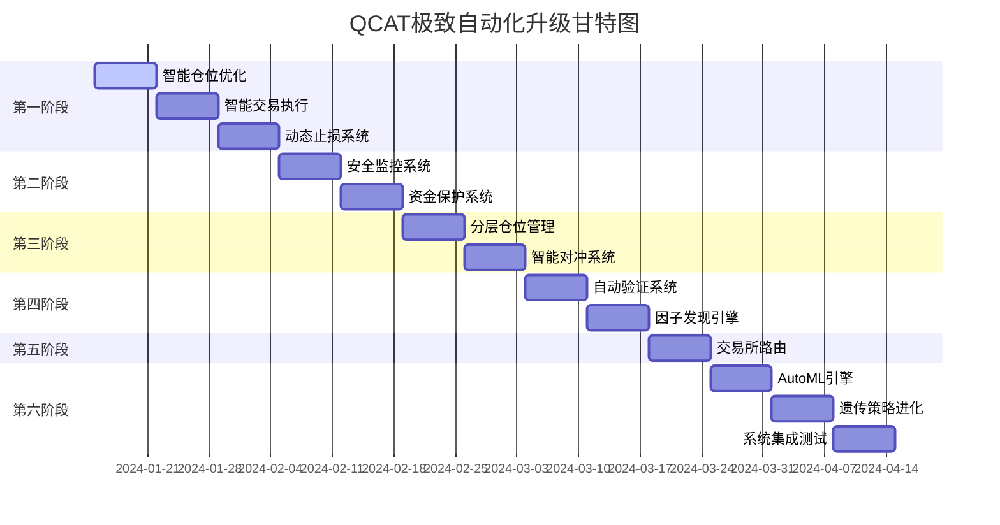

# QCAT 极致自动化升级计划 v2.0

## 升级目标
基于当前QCAT项目基础，实现《量化交易系统功能清单.md》中定义的全部26项自动化功能，打造"完全自动化"的量化交易系统。

## 当前状态评估
- 已实现功能: 10/26 (38.5%)
- 待升级功能: 16/26 (61.5%)

## 极致升级架构

```
QCAT 极致自动化系统架构 v2.0
├── 智能决策层 (新增)
│   ├── AutoML引擎 - 策略自学习与进化
│   ├── 市场模式识别器 - 全市场状态智能识别
│   └── 利润最大化引擎 - 全局优化决策
├── 自动化执行层 (升级)
│   ├── 智能交易引擎 - 升级版策略执行
│   ├── 动态风控系统 - 智能风险管理
│   └── 资金智能分配器 - 全自动资金管理
├── 数据智能层 (新增)
│   ├── 因子发现引擎 - 自动因子挖掘
│   ├── 数据质量监控 - 智能数据校正
│   └── 市场情报收集 - 多维数据融合
├── 运维自愈层 (升级)
│   ├── 自愈容错系统 - 智能故障处理
│   ├── 多交易所路由 - 智能交易所切换
│   └── 安全防护系统 - 智能安全监控
└── 持续进化层 (新增)
    ├── 遗传策略池 - 策略进化算法
    ├── 性能自优化 - 系统自我调优
    └── 知识图谱 - 交易知识积累
```

## 分阶段升级计划

### 🚀 第一阶段：交易与策略极致自动化 (第1-3周)

#### 1.1 智能仓位动态优化 (功能3)
**文件**: `internal/intelligence/position/dynamic_optimizer.go`
```go
// 实现Kelly公式+Black-Litterman+风险预算的多维度仓位优化
type DynamicPositionOptimizer struct {
    kellyCalculator    *KellyCalculator
    blackLitterman     *BlackLittermanModel
    riskBudgetManager  *RiskBudgetManager
    marketRegimeDetector *MarketRegimeDetector
}
```

#### 1.2 智能建仓/减仓/平仓 (功能4)
**文件**: `internal/intelligence/trading/smart_executor.go`
```go
// 基于深度学习的智能交易执行器
type SmartTradingExecutor struct {
    liquidityAnalyzer   *LiquidityAnalyzer
    impactCostPredictor *ImpactCostPredictor
    timingOptimizer     *TimingOptimizer
    slippageMinimizer   *SlippageMinimizer
}
```

#### 1.3 动态止盈止损调整 (功能5+9)
**文件**: `internal/intelligence/risk/dynamic_stops.go`
```go
// 基于ATR、波动率、市场情绪的动态止损系统
type DynamicStopManager struct {
    atrCalculator       *ATRCalculator
    volatilityPredictor *VolatilityPredictor
    sentimentAnalyzer   *SentimentAnalyzer
    regimeDetector      *RegimeDetector
}
```

#### 1.4 策略淘汰与进化 (功能7)
**文件**: `internal/intelligence/strategy/evolution_manager.go`
```go
// 遗传算法驱动的策略进化系统
type StrategyEvolutionManager struct {
    geneticAlgorithm    *GeneticAlgorithm
    performanceTracker  *PerformanceTracker
    mutationOperator    *MutationOperator
    crossoverOperator   *CrossoverOperator
}
```

#### 1.5 新策略智能引入 (功能8)
**文件**: `internal/intelligence/strategy/auto_discovery.go`
```go
// AutoML驱动的策略自动发现系统
type AutoStrategyDiscovery struct {
    featureExtractor    *FeatureExtractor
    modelSelector       *ModelSelector
    hyperparamTuner     *HyperparameterTuner
    backtestValidator   *BacktestValidator
}
```

#### 1.6 利润最大化引擎 (功能11)
**文件**: `internal/intelligence/optimization/profit_maximizer.go`
```go
// 全局利润最大化决策引擎
type ProfitMaximizationEngine struct {
    portfolioOptimizer  *PortfolioOptimizer
    capitalAllocator    *CapitalAllocator
    riskAdjuster        *RiskAdjuster
    costMinimizer       *CostMinimizer
}
```

### 🛡️ 第二阶段：风险与安全极致自动化 (第4-5周)

#### 2.1 账户安全智能监控 (功能13)
**文件**: `internal/intelligence/security/account_guardian.go`
```go
// 基于行为分析的账户安全卫士
type AccountSecurityGuardian struct {
    behaviorAnalyzer    *BehaviorAnalyzer
    anomalyDetector     *AnomalyDetector
    threatIntelligence  *ThreatIntelligence
    responseAutomator   *ResponseAutomator
}
```

#### 2.2 资金分散与转移 (功能14)
**文件**: `internal/intelligence/security/fund_protector.go`
```go
// 智能资金保护与分散系统
type FundProtectionSystem struct {
    riskAssessor        *RiskAssessor
    transferScheduler   *TransferScheduler
    coldWalletManager   *ColdWalletManager
    emergencyProtocol   *EmergencyProtocol
}
```

### 💰 第三阶段：资金管理极致自动化 (第6-7周)

#### 3.1 仓位分层机制 (功能16)
**文件**: `internal/intelligence/position/layered_manager.go`
```go
// 智能分层仓位管理系统
type LayeredPositionManager struct {
    layerCalculator     *LayerCalculator
    partialFillManager  *PartialFillManager
    riskDistributor     *RiskDistributor
    performanceTracker  *LayerPerformanceTracker
}
```

#### 3.2 多策略智能对冲 (功能17)
**文件**: `internal/intelligence/hedging/smart_hedger.go`
```go
// 基于相关性分析的智能对冲系统
type SmartHedgingSystem struct {
    correlationAnalyzer *CorrelationAnalyzer
    hedgeRatioCalculator *HedgeRatioCalculator
    pairSelector        *PairSelector
    dynamicRebalancer   *DynamicRebalancer
}
```

### 📊 第四阶段：数据分析极致自动化 (第8-9周)

#### 4.1 自动回测与前测 (功能19)
**文件**: `internal/intelligence/backtesting/auto_validator.go`
```go
// 自动化回测与前瞻性验证系统
type AutoBacktestValidator struct {
    dataUpdater         *DataUpdater
    strategyTester      *StrategyTester
    performanceEvaluator *PerformanceEvaluator
    reportGenerator     *ReportGenerator
}
```

#### 4.2 因子库动态更新 (功能20)
**文件**: `internal/intelligence/factors/factor_discovery.go`
```go
// 智能因子发现与评估系统
type FactorDiscoveryEngine struct {
    factorMiner         *FactorMiner
    significanceTest    *SignificanceTest
    icAnalyzer          *ICAnalyzer
    factorRotation      *FactorRotation
}
```

### 🔧 第五阶段：运维容错极致自动化 (第10-11周)

#### 5.1 多交易所智能冗余 (功能22)
**文件**: `internal/intelligence/exchange/smart_router.go`
```go
// 智能交易所路由与切换系统
type SmartExchangeRouter struct {
    healthMonitor       *ExchangeHealthMonitor
    latencyTracker      *LatencyTracker
    liquidityComparer   *LiquidityComparer
    failoverManager     *FailoverManager
}
```

### 🧠 第六阶段：学习与自我进化 (第12-14周)

#### 6.1 策略自学习 (功能24)
**文件**: `internal/intelligence/ml/automl_engine.go`
```go
// AutoML驱动的策略自学习系统
type AutoMLEngine struct {
    modelFactory        *ModelFactory
    featureEngineer     *FeatureEngineer
    hyperOptimizer      *HyperparameterOptimizer
    ensembleBuilder     *EnsembleBuilder
}
```

#### 6.2 遗传淘汰制升级 (功能25)
**文件**: `internal/intelligence/evolution/genetic_strategy.go`
```go
// 高级遗传算法策略进化系统
type GeneticStrategyEvolution struct {
    populationManager   *PopulationManager
    fitnessEvaluator    *FitnessEvaluator
    mutationEngine      *MutationEngine
    selectionOperator   *SelectionOperator
}
```

## 核心创新技术

### 1. 智能决策树
- **市场状态机**: 实时识别趋势/震荡/突破/反转等8种市场状态
- **策略路由器**: 根据市场状态自动切换最优策略组合
- **风险预算分配**: 动态调整各策略风险预算

### 2. 深度学习集成
- **价格预测模型**: LSTM+Transformer混合模型
- **波动率预测**: GARCH-LSTM模型
- **流动性预测**: 基于订单簿的深度学习模型

### 3. 强化学习框架
- **交易时机优化**: PPO算法优化入场出场时机
- **仓位动态调整**: A3C算法实现连续仓位控制
- **对冲策略学习**: Multi-Agent强化学习

### 4. 知识图谱系统
- **交易知识积累**: 构建交易决策知识图谱
- **经验传承**: 历史决策模式学习与复用
- **异常检测**: 基于图神经网络的异常模式识别

## 性能目标

### 延迟优化
- 信号生成延迟: < 10ms
- 订单执行延迟: < 50ms  
- 风控检查延迟: < 5ms
- 数据处理延迟: < 100ms

### 准确性提升
- 方向预测准确率: > 65%
- 止损触发准确率: > 80%
- 异常检测准确率: > 95%
- 风险预测准确率: > 85%

### 自动化程度
- 人工干预频率: < 1次/周
- 自动决策覆盖率: > 95%
- 异常自愈成功率: > 90%
- 策略自适应速度: < 1小时

## 安全与合规升级

### 多重安全防护
- **行为生物识别**: 基于交易行为的身份验证
- **零信任架构**: 所有访问均需验证
- **加密计算**: 同态加密保护敏感数据
- **联邦学习**: 模型训练数据不出域

### 审计与合规
- **全链路追踪**: 每个决策的完整路径记录
- **实时合规检查**: AI驱动的合规监控
- **风险量化**: 实时VaR和压力测试
- **监管报告**: 自动生成合规报告

## 升级实施路线图



## 成功标准

1. **完全自动化**: 实现26项自动化功能，人工干预 < 1次/周
2. **智能化程度**: AI决策准确率 > 80%，异常自愈成功率 > 90%
3. **性能卓越**: 延迟 < 50ms，可用性 > 99.9%
4. **收益优化**: 相比v1.0版本，夏普比率提升 > 30%
5. **风控强化**: 最大回撤控制在 < 5%，风险事件零容忍

## 资源配置

- **开发团队**: 后端开发3人，算法工程师2人，前端开发1人
- **计算资源**: GPU集群用于深度学习训练，高频交易服务器
- **数据资源**: 多维市场数据，新闻情感数据，社交媒体数据
- **外部服务**: 云服务，CDN，监控告警，数据供应商

这个升级将使QCAT从一个"自动化交易系统"进化为"智能化交易系统"，实现真正的完全自动化！
