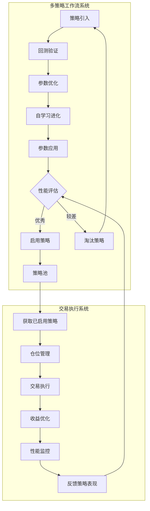

# 双闭环架构设计分析

## 架构概述

升级后的QCAT系统形成了两个独立但相互关联的闭环系统，通过策略池接口实现协同工作。

## 🔄 第一个闭环：9层架构交易执行系统

### 系统职责
专注于**已启用策略的交易执行**，确保交易的稳定性和效率。

### 包含的层级
```
第9层: 安全保障层    [14, 22] - 资金转移、交易所冗余
第8层: 收益优化层    [11]    - 利润最大化引擎
第7层: 交易执行层    [4,5,9] - 建仓平仓、止盈止损
第6层: 仓位管理层    [15,3,16,17] - 资金分配、仓位优化
第5层: [已启用策略池] - 来自多策略工作流系统
第2层: 监控分析层    [26,12,13] - 市场分析、风险监控
第1层: 基础数据层    [18,21,23] - 数据清洗、系统监控
```

### 核心特点
- ✅ **高稳定性**：专注交易执行，减少干扰
- ✅ **低延迟**：优化的交易执行路径
- ✅ **风险控制**：完整的风险管理体系
- ✅ **资金安全**：多层安全保障机制

### 执行流程
```
数据清洗 -> 市场分析 -> 策略池获取 -> 仓位管理 -> 交易执行 -> 收益优化 -> 安全保障
```

## 🧬 第二个闭环：多策略工作流系统

### 系统职责
专注于**策略的持续优化和进化**，源源不断地产生优质策略。

### 包含的层级
```
策略应用层    [2,7,10] - 参数应用、策略淘汰
策略优化层    [1,6,24,25] - 参数优化、自学习
策略管理层    [8,19,20] - 策略引入、回测
```

### 核心特点
- ✅ **高并发**：支持多个策略同时优化
- ✅ **智能进化**：基于遗传算法的策略进化
- ✅ **自动化**：全流程自动化策略管理
- ✅ **资源隔离**：每个策略独立资源池

### 执行流程
```
策略引入 -> 回测验证 -> 参数优化 -> 自学习进化 -> 参数应用 -> 策略淘汰/启用
```

## 🔗 关键交互点：策略池接口

### 接口设计
```go
type StrategyPoolInterface interface {
    // 获取已启用策略
    GetEnabledStrategies() []*EnabledStrategy
    
    // 策略状态变更通知
    OnStrategyEnabled(strategyID string)
    OnStrategyDisabled(strategyID string)
    
    // 策略性能更新
    UpdateStrategyPerformance(strategyID string, metrics *PerformanceMetrics)
    
    // 检查策略是否启用
    IsStrategyEnabled(strategyID string) bool
}
```

### 交互机制
1. **策略输出**：多策略系统将优化完成的策略标记为"已启用"
2. **策略获取**：交易系统从策略池获取已启用策略
3. **性能反馈**：交易系统将策略实际表现反馈给多策略系统
4. **动态调整**：基于反馈进行策略的启用/禁用决策

## 📊 双闭环协同工作流程

### 完整工作流程


### 数据流向
1. **策略流向**：多策略系统 → 策略池 → 交易系统
2. **性能反馈**：交易系统 → 策略池 → 多策略系统
3. **市场数据**：基础数据层 → 两个系统共享
4. **配置同步**：配置中心 → 两个系统

## 🎯 双闭环的优势

### 1. 职责分离
- **交易系统**：专注执行，追求稳定和效率
- **策略系统**：专注创新，追求优化和进化

### 2. 风险隔离
- 策略优化过程不影响正在进行的交易
- 交易执行的稳定性不受策略实验影响

### 3. 资源优化
- 交易系统：优化延迟和吞吐量
- 策略系统：优化计算资源和并发能力

### 4. 扩展性强
- 两个系统可以独立扩展
- 支持不同的部署和运维策略

## ⚠️ 需要注意的挑战

### 1. 数据一致性
- 确保两个系统的策略状态同步
- 处理网络分区和系统故障情况

### 2. 性能监控
- 需要跨系统的性能关联分析
- 建立统一的监控和告警体系

### 3. 配置管理
- 两个系统的配置需要协调
- 避免配置冲突和不一致

### 4. 故障处理
- 一个系统故障时的降级策略
- 数据恢复和同步机制

## 🔧 实现建议

### 1. 事件驱动架构
```go
// 策略状态变更事件
type StrategyEvent struct {
    Type       StrategyEventType
    StrategyID string
    Data       interface{}
    Timestamp  time.Time
}
```

### 2. 健康检查机制
```go
// 系统健康检查
type HealthChecker interface {
    CheckHealth() HealthStatus
    GetMetrics() SystemMetrics
}
```

### 3. 配置中心
```yaml
# 统一配置管理
system_config:
  trading_system:
    enabled: true
    max_strategies: 20
  
  strategy_system:
    enabled: true
    max_concurrent: 10
```

## 📈 性能预期

### 交易执行系统
- **延迟**：< 10ms（策略决策到订单发送）
- **吞吐量**：> 1000 TPS
- **可用性**：99.9%

### 多策略工作流系统
- **并发策略**：10个策略同时优化
- **策略产出**：每天2-5个新策略
- **优化效率**：相比原系统提升5-10倍

## 总结

双闭环架构通过职责分离和专业化，实现了：
- 🎯 **更专注**：每个系统专注自己的核心职责
- 🚀 **更高效**：并行处理，资源优化利用
- 🛡️ **更稳定**：风险隔离，故障影响最小化
- 🔄 **更智能**：持续的策略优化和进化

这种架构为QCAT系统提供了强大的扩展能力和长期的竞争优势。
